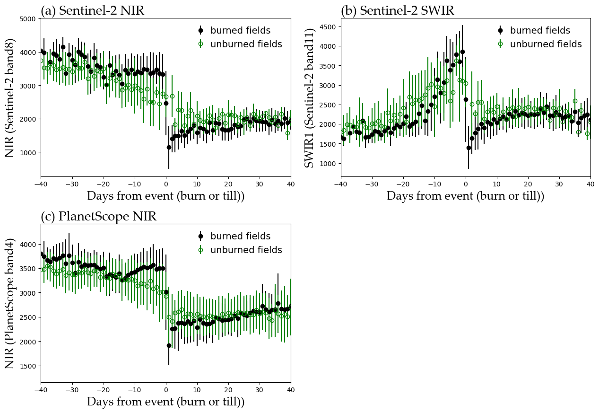

## Data preparation and model for predicting crop residue burning outcomes in sampled fields in Punjab, India
This repository was prepared to support publication of "Money (not) to burn: Payments for ecosystem services to reduce crop residue burning" (MNTB). 

```bibtex
@article{MNTB,
  title={Money (not) to burn: Payments for ecosystem services to reduce crop residue burning},
  author={Jack, B. Kelsey and Jayachandran, Seema and Kala, Namrata and Pande, Rohini},
  year={2024},
  publisher={American Economic Review: Insights}
}
```

It includes code for "Detecting crop burning in India using satellite data" (DCBII; [available here](https://arxiv.org/abs/2209.10148)), which provides additional detail and discussion of the approach used to construct the remote sensing based crop residue burning predictions for the sample of study fields.

```bibtex
@article{DCBII,
  title={Detecting crop burning in India using satellite data},
  author={Walker, Kendra and Moscona, Ben and Jack, Kelsey and Jayachandran, Seema and Kala, Namrata and Pande, Rohini and Xue, Jiani and Burke, Marshall},
  year={2022},
  publisher={ArXiv}
}
```
The primary purpose of this repository is to archive the processing details of MNTB and DCBII. Because this was a multi-year process with a different set of authors involved in the initial setup than the final output, some of these steps may appear disjoined or otherwise deviate from what we might currently recommend to someone looking to set up a similar project of this nature. While our primary purpose is to describe actual implementation, we flag deviations and potential areas for improvement or streamlining below, and invite interested researchers to contact us for further details.

### Data access for replication
Note that we cannot publicly provide all of the files necessary for replication of the remotely sensed burn prediction model. Specifically, the random forest model requires labeled data on the burn status of actual locations (i.e., personally identifiable information or PII), which in turn determines the remote sensing imagery needed for replication. The IRB of the Institute for Financial Management Research (IFMR), Chennai, India, prohibits the release of any PII, including the the spatial location of farmers' fields. Use of PII is restricted to personnel and researchers covered by the original IRB approval.

The Planet imagery used in our analysis is governed by a university license granted to UCSB, which limits publication rights to: ``(i) use, access, and view Content through the Platform; (ii) to reproduce, store, display, and print Content; (iii) create Derivative Products; and (iv) publish articles related to or based upon the Content; all for non-commercial purposes, and solely in education and research journals. Licensee agrees that all such publications must include an attribution that clearly and conspicuously identifies Planet Labs Inc. as the source of the Content on which the publication was based.`` Note that Content refers to ``data generated from satellite imagery made available to Licensee pursuant to the terms of this Agreement and as set forth in detail in an applicable Order Schedule.`` We provide instructions on processing Planet data for use in the random forest model for users with their own license. The Sentinel-2 imagery is publicly available and we provide instructions for access below.  We have provided de-identified or aggregated datasets to replicate code in compliance with these restrictions. 

### Computing environment:
This project was originally intended to be run on a personal computer (with extra 1TB storage drive). Because the PlanetScope imagery involved is greater than 500 GB, the design involves clipping this imagery to the bounds of the polygon data to reduce the data load such that subsequent modelling steps can be run more quickly. These initial data reduction steps were found to take a lot of time (weeks) on an 8 core computer and were thus transferred to an HPC cluster environment. .py functions described below can be run directly after installing this repo in any python environment. The Bash scripts we used to run the scripts through a SLURM workload manager on the HPC cluster are also provided for all tasks that we ran on the HPC environment. We ran lighter tasks on a personal computer through Jupyter notebooks provided in this repo.

Basic workflow includes:
* [Environment setup](#Setup)
* [Data acquisition](#Data-acquisition)
* [Pipeline to reduce PlanetScope data load](#PlanetScope-data-reduction)
* [Sentinel-2 data prep](#Sentinel-2)
* [Cloud masking](#Cloud-masking)
* (note that other inter-image calibration is not performed because PlanetScope data was downloaded with the PlanetScope to Sentinel-2 harmonization tool already applied.
* [Feature development](#Feature-generation)
* [Random Forest Model](#Random-forest-model)
* [LOOCV](#leave-one-out-cross-validation (LOOCV))
* [Pixels to Fields](#Pixel-level-to-field-level-calcs)
* [Projecting model to unlabeled polygons](#Projecting-model-to-unlabeled-polygons)

## Setup:
### installation on linux:

Create a virtual environment and install repo from GitHub  
e.g. using Anaconda:
```
conda create --name venv.burntfields python=3.8
conda activate venv.burntfields
conda config --env --add channels conda-forge
conda config --env --set channel_priority strict
conda install numpy==1.23.1 rasterio==1.3.0
conda install gdal==3.5.0
git clone https:/github.com/klwalker-sb/burntfields_punjab.git
cd burntfields_punjab/
python setup.py build && pip install . numpy==1.23.1 rasterio==1.3.0 gdal==3.5.0
```

Functions run on an HPC environment were run though SLURM via the accompanying Bash scripts in the BashScripts folder (copied into the run directory on the remote computer).

Most .py scripts can also be run individually on a remote or local computer by uncommenting the command at the bottom of the script.
These scripts are also called from Jupyter Notebooks used to run various lighter tasks on a personal computer. These notebooks are included in the LocalScripts folder and referred to below when used.

## Pipeline:

### Data acquisition:
All PlanetScope and Sentinel-2 data for the AOI (`Data/AOI.geojson`) from 1-Oct to 10-Dec 2019 with <10% cloud cover were downloaded. 

* **PlanetScope imagery** PlanetScope images were downloaded as 4-band Surface Reflectance products using the Harmonization option from Planet.
The list of ids for PlanetScope images downloaded is provided in `Data/PlanetList_2019_ALL.txt`. We used the [ArcGIS Pro Add-in](https://developers.planet.com/docs/integrations/arcgis/quickstart) to generate the order, followed by the `multiproc` function from the [Porder repo](https://github.com/tyson-swetnam/porder) to download the imagery onto the HPC cluster (using the `Planet_dl_porder.job` Bash script). (Originally, we used the `idlist` and `order` functions from the porder repo via the `Planet_list_porder.job` and `Planet_order_porder.job` Bash scripts to generate the Planet orders prior to downloading. However, with the release of the harmonized PlanetScope imagery (not available through the Porder repo at the time) and more interactive ordering methods from Planet Labs, we found it easier to generate the order locally.) 

* **Sentinel-2 imagery** Sentinel-2 images were downloaded as L2A products for the main 2019 model. (Due to the unavailability of pre-processed L2A products before 2019, Sentinel images for the 2018 replication were downloaded as L1C products and converted to MSIL2A using Sen2Cor in SNAP (with default parameters). Sentinel-2 imagery was downloaded directly from ESA at [Copernicus](https://scihub.copernicus.eu/dhus/#/home). We downloaded corresponding CloudProbability masks from Google Earth Engine (as we have determined these to be a bit better than the native SCL masks that come with the product). The downloading script we used for the CloudProbability masks is provided in `BashScripts/Sentinel_from_GEE`. The list of ids for Sentinel-2 images downloaded (with ESA and Google Earth Engine formats) is provided in `Data/Sentinel_images.txt`. Images not included in the analysis due to extensive cloud cover are noted in this file.

* **Training/validation data** Training and validation data for this analysis consists of field perimeter polygons of fields known to be burned or not burned during the season in question. Fields were visited on the ground and polygons were delimited with GPS for DCBII.  See the [DCBII publication](https://arxiv.org/abs/2209.10148) for a description of how the training data was collected, and MNTB for further detail on the sampling design. The polygons for the visited fields are considered Personally Identifying information (PII) and cannot be provided to the public. The sample file `Data/shapefiles/clean_2Tp_example.shp` is provided to maintain code structure only. The polygons within are not actual fields, but the data structure is the same as the original data. It is essential that each field have a unique numerical id with a field called 'unique_id' (which are 10-digit ids for DCBII).

>[!NOTE]
For those looking to build a similar model: training/validation data can come from locations visited on the ground or be extracted from satellite imagery, but must consist of labeled data for both burned fields and fields that are not burned throughout the entire season. See (Walker_2024) for a discussion on the need for labels from both cases and the difficulty of obtaining such data.

[Walker_2024](#2)

* **Prediction sites** For DCBII, predictions sites are also polygons representing field perimeters for fields where the burn status is unknown. The format of the predictions sites is identical to that of the training sites, except that they contain no label data. 

>[!NOTE]      
The fact that predictions are only desired for a known set of polygons in DCBII has led to a unique data processing pipeline where only imagery around these polygons is retained. This approach has the advantage of substantially reducing data storage requirements but would not work if a surface-level prediction is desired, or if one might want to extrapolate to unknown fields within the study area in the future. If surface level extrapolation is desired, a gridded design utlising Xarray to handle data in stacked chunks would be more useful. Kendra Walker maintains other repos that use this structure and can be contacted for further detail.

### Image processing:
Image processing steps included applying cloud masks to imagery and reducing the dataset to a manageable size such that subsequent modelling steps could be performed outside the HPC environment. Note that model predictions were required only for the 3206 known polygons contained in the ground dataset (see note above). The following steps outline the processing sequence used for DCBII and the exact tasks to replicate those results.      

#### PlanetScope data reduction
Downloading all PlanetScope imagery for a location over a couple of months can result in a large amount of data. For the 5600 km<sup>2</sup> DBII study area, all PlanetScope imagery for 2.5 months takes just over 500 GB of storage. The following steps reduce this data load to < 1 GB, by clipping data to just the polygons of interest.

1) run **clip_images_to_bbox.py** script :
```
burntfields clip_images \
   --aoi_file "<path/to/data_dir>/lon_lat_bbox_600m_example.csv" \
   --in_dir "<path/to/image_dir/planet>/SR_Harmonized" \
   --out_dir "<path/to/image_dir/planet>/SR_clipped"
```
The bounding box info is contained within the file "data/lon_lat_bbox_600m_example.csv" (which represents an altered subset of the actual dataset; polygons were moved to protect participants' privacy and do not represent real fields on the ground. The structure of the dataset remains the same). bboxes are 600m2 squares surrounding the centroid of each field polygon. This file must contain a 'unique_id' column and bounding geometry in LatLon in columns with headings: 'maxLat', 'minLat', 'maxLon', 'minLon'). 

This has a long run time (~24hrs for 1 batch of 75 unique_IDs on 1 core) and was run through a SLURM manager via the Bash script: `BashScripts/2_clip_to_bbox.sh`. The Bash script allows this function to be run as an array by dividing the bbox file into multiple files named 1.csv,2.csv,3.csv... and using the SBATCH --array option. 
`split_csv_file.py` was used to divide polygon list (AOIs) into chunks for array processing:
```
burntfields split_csv \
   --aoi_file = "<path/to/data_dir>/lon_lat_bbox_600m_example.csv" \ 
   --out_dir = "<path/to/data_dir>/bbox_AOIs" \
   --nrows = 1
```
Note that "clip_images_to_bbox.py" requires that the .xml files provided with the original downloaded images are present in the image folder. In the case that these .xml files were missing or improperly formatted, we created a stand-in file with **make_extent_xml.py** (in the LocalScripts directory -- after copying the .py script into the run directory, we ran the Bash script: `BashScripts/2a_make_extent_xml.job`).

2) Run **rm_blanks.py** via Bash script: `BashScripts/3_remove_blank_files` This removes blank files where the bbox intersects with rectangular image bounds but not with actual imagery
```
burntfields rm_blanks \
    --out_dir "<path/to/image_dir/planet>/SR_clipped" \
    --endstring '.tif'
```
3) Run **filter_images.py** via Bash script: `BashScripts/4_remove_images.sh` to remove extra images that should not be included in  analysis. For DCBII, images with ids in `Data/Planet_2019_cloudy_scenes.csv` were removed.
```
burntfields rm_images \ 
    --rm_file "<path/to/image_dir/planet>cloudy_scenes.txt" \ 
    --in_dir "<path/to/planet_image_dir>/SR_clipped" \
    --out_dir "<path/to/image_dir/planet>/SR_clipped_2"   
```
4) Cloud Masking is done at this point, and is discussed [here](#cloud-masking)

5) Run **clip_images_to_poly.py** script
      This reduces the DCBII dataset to <1GB.
      This produces a log with some file error issues (images do not overlap), which can be found in .out logs 
```
burntfields clip_to_poly \
    --shapefile "<path/to/data_dir>/shapefiles/clean_2Tp_example.shp" \
    --shape_filter "<path/to/data_dir>/bbox_AOIs/1.csv" \
    --in_dir "<path/to/image_dir/planet>/SR_masked" \
    --out_dir "<path/to/image_dir/planet>/TS_polys" \
    --mstring '.tif' \ 
    --num_cores 1 
```    
Running clip_to_poly via the Bash script: `BashScripts/6_clip_to_poly.sh` allows for array processing with a chunked aoi list (filter) as with clip_images_to_bbox.

6) Run **rm_blanks.py** again via Bash script `BashScripts/7_remove_blank_files2` to remove observations where the bounding box 
      overlapped an image but the actual polygon did not.
```
burntfields rm_blanks \
    --out_dir "<path/to/image_dir/planet>/TS_polys_2" \ 
    --endstring ".tif"
```

#### Sentinel-2
1) The 20 m bands (within "granules/.../images/R20m" -- 2,3,4,5,6,7,8A,11,&12) were stacked into a multiband .tif in ArcGIS prior to loading onto the cluster. For the subsequent code to work, the files need to be named with the observation date (YYYMMDD) as the first 8 digits after the first '_' (for example T43RDP_20191010T053731_B2345678A1112.tif) 

2) Cloud masks are applied at this point. See [cloud masking](#cloud-masking) below for details.

3) Images are clipped to bounding boxes with `clip_images_to_bbox_Sentinel.py` script 
     (this takes ~48hrs for 800 polygons; can be run on multiple processors by chunking the polygon list)
     
4) Clipped images are resampled to 3 m resolution to match Planet cells with: `resample_ras` script
     This script also clips to shapefile polygons and masks, so no need to run 'clip_images_to_shapefile'
     
(If not matching Sentinel data to Planet data (i.e for separability analysis or to flag/drop edge pixels), can skip 'resample_ras' and run 
'clip_images_to_shapefile' instead (this runs quickly; no need to chunk))

#### BASMA
Weekly BASMA layers were created from the Sentinal-2 imagery using the general concept and methods in [Daldegan et. al_2019](#3). 
Burned endmembers were created for each week by manually identifying 15 charred locations in individual Sentinel-2 images and extracting the band data for each polygon. The endmember spectral library was then built using Principal Component Analysis, using the R script: `LocalScripts/BASMA_endmemberOptimizaton.R` (contributed by Ben Moscona). Our endmember outputs and final weekly layers with the spectral mixture analysis applied are provided in the Zenodo data archive: 10.5281/zenodo.10987987. (band 0 = green vegetation, band 1 = Non-productive vegetation and bare soil, band 2 = Char (burned)). Note that our study period was eight weeks, but Sentinel images for weeks 5 and 6 were too cloudy to produce BASMA layers. Weeks 7 and 8 were renamed to 5 and 6, respectively, for the code to work.   

#### Cloud masking
For PlanetScope imagery, cloud masks were applied with the **apply_masks.py** function:
```
burntfields mask\ 
    --in_dir "<path/to/image_dir/planet>/SR_clipped" \
    --out_dir "<path/to/image_dir/planet>/SR_masked" \
    --out_type 'udm2csorig' \
    --endstring 'AnalyticMS_SR' \
```
This was run via Bash script: `BashScripts/5_mask_clouds.sh`.
For DCBII, we used default masking option which includes the cloud & shadow bands of UDM2 + original mask from UDM (='udm2csorig') (UDM & UDM2 are the cloud masks provided with the PlanetScope imagery). 

Other mask options are:
* 'udm' = mask based on original udm file (with all quality issues masked)
* 'udm2all' = mask based on 1st band of udm2 file (with all files masked)
* 'udm2cs' = mask based on cloud/shadow bands of udm2
* 'udm2csorig' = mask based on cloud/shadow bands of udm2 + original udm mask

(Runtime ~17hrs for images from all 3200 polygons)

For Sentinel imagery, Cloudless probabilities (cp) masks downloaded from Google Earth Engine were applied with **apply_masks_sentinel.py**. Probabilities were first converted into binary masks with a 50% threshold applied (1 if cp >=.5, else 0).  Some images had substantial shadows that remained largely unmasked by both the native SCL masks and the GEE-Cloudless probabilities masks. We retouched these by hand (in ArcGIS Pro) and provide the retouched masks in the Zenodo data archive: 10.5281/zenodo.10987987

### Feature generation

Features were generated for the set of combined indices described in Fig 2 of DCBII. 
Code to analyze separability between measures for pre vs. post burn and burned vs. tilled fields for each index is provided in Notebooks `Plot_Separability.ipynb` and `Plot_TS_signatures.ipynb` (in the LocalScripts folder).
`Plot_Separability.ipynb` includes code to reproduce Figs. 4 & 5 of DCBII as well as other figures to explore separability:
Fig 4             |  Fig 5
:-------------------------:|:-------------------------:
  |   


`Plot_TS_signatures.ipynb` includes code to reproduce Fig 6 of DCBII.



min, max, median and outer percentiles (10th, 20th, 80th & 90th) and max diff for time t+1 vs time t were calculated for each individual band and combined index, as described in section 2.3 of DCBII. These calculations are performed in **pixel_calcs.py**    

```
burntfields get_all_pixel_calcs \
    field_list "<path/to/data_dir>/lon_lat_bbox_600m_example.csv" \ 
    data_dir "<path/to/image_dir/planet>/SR_poly_2" \
    out_dir "<path/to/out_dir>" \
    num_bands 4 \  
    var_path "<path/to/data_dir>/PixelLevel_variables_Planet.csv"
```
This function can be run on cluster or on a local computer via `image_processing.ipynb` Notebook in the LocalScripts folder.
We added a flag for pixels along the border of polygons (field edges) to explore dropping or weighting these pixels. The steps for identifying border pixels are outlined in `image_processing.ipynb` 

Note that the num_bands parameter will determine the sensor/product used. (9 for Sentinel, 4 for Planet and 3 for BASMA).
The original full set of variables run for each sensor is provided in `data/PixelLevel_variables_<Sensor>_ALL.csv`.
For the combined datasets, the dataframes for each sensor were joined.
The final set of variables used following bootstrapped optimization (below) are provided in `data/PixelLevel_variables_<Sensor>_Final.csv`

### Random forest model
Modeling steps are outlined in the Notebook `build_RFmodel.ipynb` in the LocalScripts folder, which relies on functions in **rf_model.py** 
Most steps run quickly and were run directly from the notebook, with the exception of bootstrapping and LOOCV methods, which were run in an HPC environment. [see here for LOOCV details](#leave-one-out-cross-validation (LOOCV)).

Bootstrapping for feature selection and model optimization was run on the HPC cluster via **bootstrap_holdout** (in rf_model.py). When bootstrapping, holdouts are at the field level (if one pixel is held out for a field, all pixels are held out for that field) to prevent overconfident assesment of accuracy.
```
burntfields bootstrap_holdout\
    out_dir "<path/to/out_dir>" \
    field_list "<path/to/data_dir>/lon_lat_bbox_600m_example.csv" \ 
    training_path  "<path/to/model_dir>/training_out"
    variable_path "<path/to/data_dir>/PixelLevel_variables_Planet.csv" \
    num_rep 5 \
    method 'k' \
    fit True \
    all_features "<path/to/data_dir>/V4_pixelData_COMBO.csv" \
    seed1 8 \
    seed2 6888 \
    drop_border True \
    strat = strat='treatment'
```      

### leave-one-out-cross-validation (LOOCV)
For DCBII, we fit the random forest model by holding out a single labeled plot for validation while building the model with all other labelled data, thus allowing the model to take advantage of all data when labeled data is scarce.
```
burntfields loocv
    out_dir "<path/to/out_dir>" \
    labeled_list "<path/to/data_dir>/labels_2019_with_bbox_V4.csv" \ 
    ho_list "<path/to/out_dir>/Punjab_LOOCV/HOSets/1.csv" \
    variable_path "<path/to/data_dir>/Variables.csv" \
    all_features "<path/to/data_dir>/V4_pixelData_COMBO.csv" \
    seed1 8 \
    seed2 6888 \
    drop_border True
```
This was run through the Bash script, `BashScripts/LOOCV.sh` to take advantage of array-based processing. The 
**consolidate_loocv.py** (in the LocalScripts folder) was then run to recombine holdout and prediction datasets from LOOCV on cluster before downloading. This was run via the Bash script `LOOCVConsolidate.job`. (`consolidate_loocv.py` is first copied to the same folder))

### Pixel-level to poly-level calcs
Our random forest predictions are generated at the pixel level, but burn outcome was ultimately assigned at the polygon (field) level.   
We used the R script `pixel_to_field_stats_thresholds` (contributed by Ben Moscona) in LocalScripts directory to select thresholds.

### Projecting model to unlabeled polygons
Model predictions were generated with the methods in the Notebook `build_RFmodel.ipynb`. The model was bootstrapped 5 times and cutoff thresholds from the pixel-level to poly-level thresholding were applied to average scores to generate the final output.                      


## References 

<a id="1">[1]</a>
Walker, K., Moscona, B., Jack, K., Jayachandran, S., Kala, N., Pande, R., Xue, J., Burke, M. (2022). Detecting crop burning in India using satellite data. arXiv preprint arXiv:2209.10148  [Available here](https://arxiv.org/abs/2209.10148)

<a id="2">[2]</a> 
Walker, Kendra (2024). Overcoming Common Pitfalls to Improve the Accuracy of Crop Residue Burning Measurement Based on Remote Sensing Data, Remote Sensing 16 (2), 342 [Available here](https://www.mdpi.com/2072-4292/16/2/342)

<a id="3">[3]</a>
Daldegan, G.A., Roberts, D.A., de Figueiredo Ribeiro, F. (2019). Spectral mixture analysis in Google Earth Engine to model and delineate fire scars over a large extent and a long time-series in a rainforest-savanna transition zone. Remote Sensing of Environment 232, 111340


